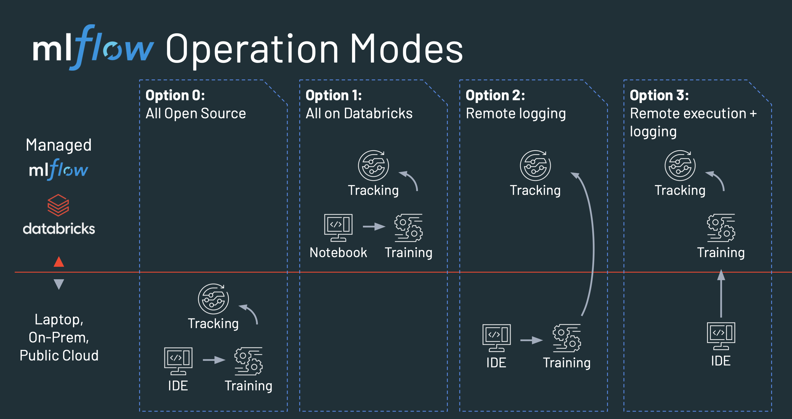

# MLflow FAQ


## General MLflow

### How do I copy an experiment or run from one MLflow tracking server to another?

I would like to:
* Back up my experiments, runs or registered models.
* Copy them into another MLflow tracking server (i.e. Databricks workspace).

There is no official MLflow support for this. 

However, there is a tool that can export/import an experiment/run with caveats for Databricks MLflow using the [public MLflow API](https://mlflow.org/docs/latest/python_api/mlflow.tracking.html).

See https://github.com/mlflow/mlflow-export-import.

TLDR:
* It works well for OSS MLflow. 
* Unfortunately for Databricks MLflow, there is currently no API call to export notebook revisions (each run has a pointer to a notebook revision). However, the model artifacts and metadata are correctly exported.

### How do I create an MLflow run from a model I have trained elsewhere?

```
import mlflow
import cloudpickle

with open("data/model.pkl", "rb") as f:
    model = cloudpickle.load(f)
with mlflow.start_run() as run:
    mlflow.sklearn.log_model(model, "sklearn-model")
model_uri = f"runs:/{run.info.run_id}/sklearn-model"
model = mlflow.sklearn.load_model(model_uri)
```

Also see: [MLflow Model Registry — Registering a Saved Model](https://mlflow.org/docs/latest/model-registry.html#registering-a-saved-model) - MLflow documentation.


### How to get the run_id of your run

Use `run_id` instead of `run_uuid` which is deprecated. No need to use `active_run` either.

Use this idiom:
```
with mlflow.start_run() as run:
   run_id = run.info.run_id
```
Instead of this: 
```
with mlflow.start_run():
   run_id = mlflow.active_run().info.run_uuid
```

### How do I find the best run of an experiment?
Use the [MlflowClient.search_runs](https://mlflow.org/docs/latest/python_api/mlflow.tracking.html#mlflow.tracking.MlflowClient.search_runs) method. A simple example is shown below where we look for the run with the lowest `RMSE` value.

```
import mlflow
client = mlflow.tracking.MlflowClient()

def get_best_run(experiment_id)
    runs = client.search_runs(experiment_id, order_by=["metrics.rmse ASC"], max_results=1)
    return runs[0]

best_run = get_best_run("3532228")
print(best_run.info.run_id, best_run.data.metrics["rmse"])

fc9337b500054dc7869f7611a74e3c62', 0.7367947360663162
```

For a full-fledged version that accounts for nested runs see [Find best run for experiment](https://github.com/amesar/mlflow-tools/blob/master/mlflow_tools/tools/README.md#find-best-run-for-experiment) and [best_run.py](https://github.com/amesar/mlflow-tools/blob/master/mlflow_tools/tools/best_run.py).

### How do I find the last run of an experiment?

Use the [MlflowClient.search_runs](https://mlflow.org/docs/latest/python_api/mlflow.tracking.html#mlflow.tracking.MlflowClient.search_runs) method. 
```
import mlflow
client = mlflow.tracking.MlflowClient()

def get_last_run(experiment_id):
    runs = client.search_runs(experiment_id, order_by=["attributes.start_time desc"], max_results=1)
    return runs[0]
```
### How do I dump run, experiment or registered model information?

I would like to see all the information of an experiment or run.

#### MLflow CLI

The mlflow CLI can dump run information but not experiment or registered model information.

```
mlflow runs describe --run-id
```

```
{
  "info": {
    "artifact_uri": "/Users/andre/work/mlflow_server/local_mlrun/mlruns/6/b8ad03e448834d95b10cd2bb4d93a2cb/artifacts",
    "end_time": 1596573698775,
    "experiment_id": "6",
    "lifecycle_stage": "active",
    "run_id": "b8ad03e448834d95b10cd2bb4d93a2cb",
    "run_uuid": "b8ad03e448834d95b10cd2bb4d93a2cb",
    "start_time": 1596573697304,
    "status": "FINISHED",
    "user_id": "andre"
  },
  "data": {
    "metrics": {
      "rmse": 0.7643663416167976,
      "r2": 0.25411980734506334,
      "mae": 0.5866955768114198
    },
    "params": {
      "max_depth": "4",
      "max_leaf_nodes": "32"
    },
    "tags": {
      "mlflow.user": "andre",
      "mlflow.source.name": "main.py",
      "mlflow.source.type": "LOCAL",
      "mlflow.source.git.commit": "180c807a1e0f283d14befcac586f41d899a5bae4",
      "mlflow.runName": "train.sh",
      "data_path": "../../data/train/wine-quality-white.csv",
      "run_origin": "train.sh",
      "version.mlflow": "1.10.0",
      "version.sklearn": "0.20.2",
      "version.platform": "Darwin-19.4.0-x86_64-i386-64bit",
      "version.python": "3.7.6",
      "mlflow.log-model.history": "[{\"run_id\": \"b8ad03e448834d95b10cd2bb4d93a2cb\", \"artifact_path\": \"sklearn-model\", \"utc_time_created\": \"2020-08-04 20:41:37.711168\", \"flavors\": {\"python_function\": {\"model_path\": \"model.pkl\", \"loader_module\": \"mlflow.sklearn\", \"python_version\": \"3.7.6\", \"env\": \"conda.yaml\"}, \"sklearn\": {\"pickled_model\": \"model.pkl\", \"sklearn_version\": \"0.20.2\", \"serialization_format\": \"cloudpickle\"}}}, {\"run_id\": \"b8ad03e448834d95b10cd2bb4d93a2cb\", \"artifact_path\": \"onnx-model\", \"utc_time_created\": \"2020-08-04 20:41:38.339746\", \"flavors\": {\"python_function\": {\"loader_module\": \"mlflow.onnx\", \"python_version\": \"3.7.6\", \"data\": \"model.onnx\", \"env\": \"conda.yaml\"}, \"onnx\": {\"onnx_version\": \"1.7.0\", \"data\": \"model.onnx\"}}}]",
      "version.onnx": "1.7.0",
      "output_path": "out_run_id.txt"
    }
  }
}
```

#### mlflow-tools

The dump commands of mlflow-tools provides you information in JSON, YAML and text formats for runs. For experiments and models only JSON is supported.
The value-add for dumping runs with the tool is that it can dump all the of run's artifact information.
See [Dump experiment or run as text](https://github.com/amesar/mlflow-tools/blob/master/mlflow_tools/tools/README.md#dump-experiment-or-run-as-text).

```
RunInfo:
  experiment_name: sklearn
  artifact_uri: /opt/mlflow/server/mlruns/6/b8ad03e448834d95b10cd2bb4d93a2cb/artifacts
  experiment_id: 6
  lifecycle_stage: active
  run_id: b8ad03e448834d95b10cd2bb4d93a2cb
  run_uuid: b8ad03e448834d95b10cd2bb4d93a2cb
  status: FINISHED
  user_id: andre
  start_time: 2020-08-04_20:41:37   1596573697304
  end_time:   2020-08-04_20:41:38   1596573698775
  _duration:  1.471 seconds
Params:
  max_depth: 4
  max_leaf_nodes: 32
Metrics:
  mae: 0.5866955768114198
  r2: 0.25411980734506334
  rmse: 0.7643663416167976
Tags:
  data_path: ../../data/train/wine-quality-white.csv
  mlflow.log-model.history: [{"run_id": "b8ad03e448834d95b10cd2bb4d93a2cb", "artifact_path": "sklearn-model", "utc_time_created": "2020-08-04 20:41:37.711168", "flavors": {"python_function": {"model_path": "model.pkl", "loader_module": "mlflow.sklearn", "python_version": "3.7.6", "env": "conda.yaml"}, "sklearn": {"pickled_model": "model.pkl", "sklearn_version": "0.20.2", "serialization_format": "cloudpickle"}}}, {"run_id": "b8ad03e448834d95b10cd2bb4d93a2cb", "artifact_path": "onnx-model", "utc_time_created": "2020-08-04 20:41:38.339746", "flavors": {"python_function": {"loader_module": "mlflow.onnx", "python_version": "3.7.6", "data": "model.onnx", "env": "conda.yaml"}, "onnx": {"onnx_version": "1.7.0", "data": "model.onnx"}}}]
  mlflow.runName: train.sh
  mlflow.source.git.commit: 180c807a1e0f283d14befcac586f41d899a5bae4
  mlflow.source.name: main.py
  mlflow.source.type: LOCAL
  mlflow.user: andre
  output_path: out_run_id.txt
  run_origin: train.sh
  version.mlflow: 1.10.0
  version.onnx: 1.7.0
  version.platform: Darwin-19.4.0-x86_64-i386-64bit
  version.python: 3.7.6
  version.sklearn: 0.20.2
Artifacts:
  Artifact 1/3 - level 0:
    path: onnx-model
    Artifact 1/3 - level 1:
      path: onnx-model/MLmodel
      bytes: 293
    Artifact 2/3 - level 1:
      path: onnx-model/conda.yaml
      bytes: 144
    Artifact 3/3 - level 1:
      path: onnx-model/model.onnx
      bytes: 2796
  Artifact 2/3 - level 0:
    path: plot.png
    bytes: 32649
  Artifact 3/3 - level 0:
    path: sklearn-model
    Artifact 1/3 - level 1:
      path: sklearn-model/MLmodel
      bytes: 357
    Artifact 2/3 - level 1:
      path: sklearn-model/conda.yaml
      bytes: 150
    Artifact 3/3 - level 1:
      path: sklearn-model/model.pkl
      bytes: 4893
Total: bytes: 41282 artifacts: 7
```

### What are MLflow system run tags?

Tag keys that start with `mlflow.` are reserved for internal use. 
See [System Tags](https://mlflow.org/docs/latest/tracking.html#system-tags) documentation page. 
Note that Databricks system tags are not documented on this page.

Column legend:
* Python - If run is created with plain old `python` command (OSS MLflow).
* MLflow project - If run is created as an MLflow project with `mlflow run` command (OSS MLflow).
* Notebook UI - If run is created from a Databricks notebook (either notebook or workspace experiment).
* Notebook job - If run is created from a Databricks notebook job (must be a workspace experiment).

As of MLflow 1.27.0.
```
+--------------------------------------+----------+------------------+---------------+----------------+
| Tag                                  | Python   | MLflow project   | Notebook UI   | Notebook job   |
|--------------------------------------+----------+------------------+---------------+----------------|
| mlflow.databricks.cluster.id         | -        | -                | Y             | Y              |
| mlflow.databricks.cluster.info       | -        | -                | Y             | Y              |
| mlflow.databricks.cluster.libraries  | -        | -                | Y             | Y              |
| mlflow.databricks.jobID              | -        | -                | -             | Y              |
| mlflow.databricks.jobRunID           | -        | -                | -             | Y              |
| mlflow.databricks.jobType            | -        | -                | -             | Y              |
| mlflow.databricks.notebook.commandID | -        | -                | Y             | Y              |
| mlflow.databricks.notebookID         | -        | -                | Y             | -              |
| mlflow.databricks.notebookPath       | -        | -                | Y             | -              |
| mlflow.databricks.notebookRevisionID | -        | -                | Y             | -              |
| mlflow.databricks.webappURL          | -        | -                | Y             | Y              |
| mlflow.databricks.workspaceID        | -        | -                | Y             | Y              |
| mlflow.databricks.workspaceURL       | -        | -                | Y             | Y              |
| mlflow.gitRepoURL                    | -        | Y                | -             | -              |
| mlflow.log-model.history             | Y        | Y                | -             | -              |
| mlflow.project.backend               | -        | Y                | -             | -              |
| mlflow.project.entryPoint            | -        | Y                | -             | -              |
| mlflow.project.env                   | -        | Y                | -             | -              |
| mlflow.runName                       | Y        | Y                | Y             | Y              |
| mlflow.source.git.commit             | Y        | Y                | -             | -              |
| mlflow.source.git.repoURL            | -        | Y                | -             | -              |
| mlflow.source.name                   | Y        | Y                | Y             | Y              |
| mlflow.source.type                   | Y        | Y                | Y             | Y              |
| mlflow.user                          | Y        | Y                | -             | -              |
+--------------------------------------+----------+------------------+---------------+----------------+
```

### What’s the difference between log_model and save_model?

`log_model` saves a model in a location relative to the experiment’s [artifact location](https://mlflow.org/docs/latest/python_api/mlflow.html#mlflow.create_experiment). With `save_model` you specify an absolute path. Both methods are flavor-specific. Definitely prefer `log_model`. In order to use the standard `load_model` method you have to use `log_model`.

See the [sklearn](https://mlflow.org/docs/latest/python_api/mlflow.sklearn.html) flavor sample methods:
  * [log_model](https://mlflow.org/docs/latest/python_api/mlflow.sklearn.html#mlflow.sklearn.log_model)
  * [save_model](https://mlflow.org/docs/latest/python_api/mlflow.sklearn.html#mlflow.sklearn.save_model)
  * [load_model](https://mlflow.org/docs/latest/python_api/mlflow.sklearn.html#mlflow.sklearn.load_model)

### Examples of MLflow Custom Python Models

* [Custom Python Models](https://mlflow.org/docs/latest/models.html#custom-python-models) - MLflow documentation
* Example: https://github.com/mlflow/mlflow/blob/master/examples/prophet/train.py

### How do I run a docker container with the MLflow scoring server on my laptop?

**Launch the MLflow tracking server in window 1**
```
mlflow server --host 0.0.0.0 --port 5000  \
  --backend-store-uri sqlite:///mlflow.db \
  --default-artifact-root $artifact_store $PWD/mlruns
```

**Create an experiment run in window 2**
```
export MLFLOW_TRACKING_URI=http://localhost:5000
```

```
mlflow run https://github.com/amesar/mlflow-examples.git#python/sklearn \
  -P max_depth=2 -P max_leaf_nodes=32 \
  -P model_name=sklearn_wine \
  --experiment-name=sklearn_wine
```

**Launch the MLflow scoring server in window 2**

Plain docker
```
mlflow models build-docker --model-uri models:/sklearn_wine/1 --name dk-wine-sklearn
docker run --p 5001:8080 dk-wine-sklearn
```

SageMaker docker container in local mode
```
mlflow sagemaker build-and-push-container --build --no-push --container sm-wine-sklearn
mlflow sagemaker run-local -m models:/sklearn_wine/1  -p 5001 --image sm-wine-sklearn
```


**Send a prediction to MLflow scoring server in window 3**
```
curl  http://localhost:5001/invocations  \
  -H "Content-Type:application/json" \
  -d '{ "columns":   [ "alcohol", "chlorides", "citric acid", "density", "fixed acidity", "free sulfur dioxide", "pH", "residual sugar", "sulphates", "total sulfur dioxide", "volatile acidity" ],
         "data": [
            [ 7,   0.27, 0.36, 20.7, 0.045, 45, 170, 1.001,  3,    0.45,  8.8 ],
            [ 6.3, 0.3,  0.34,  1.6, 0.049, 14, 132, 0.994,  3.3,  0.49,  9.5 ] ] }'
```
Response
```
[5.46875, 5.1716417910447765]
```

### MLflow Database Schema (MySQL)

See [schema_mlflow_1.22.0.sql](schema_mlflow_1.22.0.sql).

## MLflow Java Client

### MLflow Java Client Documentation

Unfortunately there is only the [Javadoc](https://mlflow.org/docs/latest/java_api/index.html).
There are no examples in [MLflow examples github](https://github.com/mlflow/mlflow/tree/master/examples).

### MLflow Scala Client

MLflow has a Java client that can be accessed from Scala.

Sample Scala code using the Java client: [github.com/amesar/mlflow-examples/tree/master/scala/sparkml](github.com/amesar/mlflow-examples/tree/master/scala/sparkml).

### MLflow Java Feature Gap

Since much of MLflow functionality is client-based and is written in Python, there is a distinct feature gap for other languages.  Standard MLflow features such as projects and flavors are not supported for Java/Scala. Basically this is since there is so little demand for JVM-based ML training vs Python. See item below. 

### Does the Java client support MLflow projects and flavors?

No. With the Java client you have to save your models as un-managed artifacts using [logArtifact](https://mlflow.org/docs/latest/java_api/org/mlflow/tracking/MlflowClient.html#logArtifact-java.lang.String-java.io.File-). There is no concept of MLflow Python’s log_model (e.g. [mlflow.sklearn.log_model](https://mlflow.org/docs/latest/python_api/mlflow.sklearn.html#mlflow.sklearn.log_model) which implies flavors. 
See example in [TrainWine.scala](https://github.com/amesar/mlflow-examples/blob/master/scala/sparkml/src/main/scala/org/andre/mlflow/examples/wine/sparkml/TrainWine.scala#L118).

### Python set_experiment() equivalent

See [MLflowUtils.getOrCreateExperimentId](https://github.com/amesar/mlflow-examples/blob/master/scala/sparkml/src/main/scala/org/andre/mlflow/util/MLflowUtils.scala#L24).

```
// Return the ID of an experiment - create it if it doesn't exist
def getOrCreateExperimentId(client: MlflowClient, experimentName: String) = {
  try { 
    client.createExperiment(experimentName)
  } catch { 
    case e: org.mlflow.tracking.MlflowHttpException => { // statusCode 400
      client.getExperimentByName(experimentName).get.getExperimentId
    } 
  } 
} 
```

### How do I score a model in Scala that was saved in Python?

Works only for SparkML (MLlib) models.

Read the model artifact with the `downloadArtifacts` method.
```
import org.apache.spark.ml.PipelineModel
import org.mlflow.tracking.MlflowClient

val client = new MlflowClient()
val modelPath = client.downloadArtifacts(runId, "spark-model/sparkml").getAbsolutePath
val model = PipelineModel.load(modelPath.replace("/dbfs","dbfs:"))
val predictions = model.transform(data)
```

### How do I score a model in Python that was saved in Scala?

Works only for SparkML (MLlib) models.

Do the same as above using the Python `MlflowClient.download_artifacts` method.

### Searching for MLflow objects - XX

MLflow allows you to search for a subset of MLflow objects. The MLflow search filter is a simplified version of the SQL WHERE clause. 

You can search for the following MLflow objects:
* Runs
* Registered Models
* Versions of a Registered Model

#### Search runs

General
* [Search — MLflow 1.26.1 documentation](https://mlflow.org/docs/latest/search-syntax.html)  - Detailed description of the filter syntax for run search.

[mlflow package](https://mlflow.org/docs/latest/python_api/mlflow.html)
* search_runs - returns a list of Pandas DataFrames.
* Note: no description or link of/to filter syntax. Just some examples.

[mlflow.tracking package](https://mlflow.org/docs/latest/python_api/mlflow.tracking.html)
* [search_runs](https://mlflow.org/docs/latest/python_api/mlflow.tracking.html#mlflow.tracking.MlflowClient.search_runs) - returns a paged list of [Run](https://mlflow.org/docs/latest/python_api/mlflow.entities.html#mlflow.entities.Run) objects.
* Note: no description or link of/to filter syntax. Just some examples.

#### Search registered models and versions

[mlflow.tracking package](https://mlflow.org/docs/latest/python_api/mlflow.tracking.html)
* [search_registered_models](XX) - returns a paged list of RegisteredModel objects.
  * filter_string – Filter query string, defaults to searching all registered models. Currently, it supports only a single filter condition as the name of the model, for example, name = 'model_name' or a search expression to match a pattern in the registered model name. For example, name LIKE 'Boston%' (case sensitive) or name ILIKE '%boston%'.
* [search_model_versions](XX) - returns a paged list of ModelVersion objects.
  * filter_string – A filter string expression. Currently, it supports a single filter condition either a name of model like name = 'model_name' or run_id = '...'.

Search experiments
Not available. :(

## Databricks MLflow

### How do I access Databricks MLflow from outside Databricks?

There are several ways run the MLflow CLI or API against a managed Databricks MLflow tracking server.

There are several ways to externally access managed Databricks MLflow. The following information applies to both the MLflow CLI and programmatic access.

See the Databricks documentation page `Access the MLflow tracking server from outside Databricks` - [AWS](https://docs.databricks.com/applications/mlflow/access-hosted-tracking-server.html) or [Azure](https://docs.microsoft.com/en-us/azure/databricks/applications/mlflow/access-hosted-tracking-server).

1. With .~/databrickscfg and no profile specified. The host and token are picked up from the DEFAULT profile.
```
export MLFLOW_TRACKING_URI=databricks
```
2. Specify profile in  ~/.databrickscfg.
```
export MLFLOW_TRACKING_URI=databricks://MY_PROFILE
```
3. To override ~/.databrickscfg values or without ~/.databrickscfg file.
```
export MLFLOW_TRACKING_URI=databricks
export DATABRICKS_HOST=https://myshard.cloud.databricks.com
export DATABRICKS_TOKEN=MY_TOKEN
```

### Databricks MLflow operation modes

There are several ways you can train and track your model with Databricks MLflow tracking server.




Three main components are:
* Coding - where you write your code - non-Databricks (IDE or Jupyter notebook) or Databricks notebook.
* Training - where the training is executed.
* Tracking - on which MLflow Tracking Server the run is logged.

Options:
* Option 0 - Coding, training and tracking are all done in a non-Databricks open source environment (e.g laptop or on-prem).
* Option 1 - Coding, training and tracking are all done in a Databricks environment.
* Option 2 - Coding and training are done on laptop and tracking is done on Databricks.
* Option 3 - Coding is done on laptop but training and tracking are done on Databricks.

### DBFS vs Fusemount file paths with MLflow

MLflow API methods do not understand DBFS file paths. You need to use the Fusemount version starting with `/dbfs` instead of `dbfs:`.

Use:
```
tf.keras.models.save_model(model, "/dbfs/mymodel.keras")
```
instead of:
```
tf.keras.models.save_model(model, "dbfs:/mymodel.keras")
```

### Specify non-DBFS artifact location for an experiment

In Databricks MLflow, the default location for artifacts is DBFS. This location is specified at the experiment level. You can provide an alternate artifact location assuming there is a corresponding artifact plugin. 

There are two major limitations to custom non-DBFS locations:
* The artifact will not appear in the UI.
* You cannot promote the model artifact to the model registry.


Open source MLflow documentation

* [Artifact Stores](https://mlflow.org/docs/latest/tracking.html#artifact-stores) - Supported plugins: Amazon S3 and S3-compatible storage, Azure Blob Storage, Google Cloud Storage, FTP server, SFTP Server, NFS and HDFS.

* [mlflow.create_experiment](https://mlflow.org/docs/latest/python_api/mlflow.html#mlflow.create_experiment) - Python API.

Create workspace experiment - Databricks MLflow documentation

* [AWS](https://docs.databricks.com/applications/mlflow/tracking.html#create-workspace-experiment) - Databricks supports DBFS, S3, and Azure Blob storage artifact locations.

* [Azure](https://docs.microsoft.com/en-us/azure/databricks/applications/mlflow/tracking#create-workspace-experiment) - Azure Databricks supports DBFS and Azure Blob storage artifact locations. Note there is no ADLS support.

### What are the Databricks MLflow API rate limits?

#### MLflow Tracking Server rate limits 

* [AWS](https://docs.databricks.com/dev-tools/api/latest/mlflow.html#rate-limits) - [Azure](https://docs.microsoft.com/en-us/azure/databricks/dev-tools/api/latest/mlflow#rate-limits) - rate limits - Databricks documentation
* Low throughput experiment management (list, update, delete, restore): 7 qps
* Search runs: 7 qps
* Log batch: 47 qps
* All other APIs: 127 qps

#### MLflow Model Serving on Databricks

* [AWS](https://docs.databricks.com/applications/mlflow/model-serving.html#mlflow-model-serving-on-databricks) - [Azure](https://docs.microsoft.com/en-us/azure/databricks/applications/mlflow/model-serving) - rate limits - Databricks documentation
* Target throughput is 20 QPS.
* Target availability is 99.5%, although no guarantee is made as to either.
* Payload size limit of 16 MB per request.

## Where do I find more of Andre's MLflow stuff?

**Github code**
* https://github.com/mlflow/mlflow-export-import - Tools to export and import MLflow runs, experiments or registered models from one tracking server to another.
* https://github.com/amesar/mlflow-examples - Examples of many different Python ML frameworks (sklearn, SparkML, Keras/TensorFlow, etc.) and some Scala examples.
* https://github.com/amesar/mlflow-tools - Tools and utilities such as export/import runs.
* https://github.com/amesar/mlflow-tensorflow-serving - creates a TensorFlow Serving Docker container with an embedded MLflow Keras TensorFlow model.
* https://github.com/amesar/mlflow-pluggable-scoring-server - Exploratory POC to plug in custom request or response payloads for MLflow serving.
* https://github.com/amesar/mlflow-spark-summit-2019 - Code for Spark Summit 2019 tutorial session - obviously dated.
* https://github.com/amesar/mleap-sampler - All things MLeap (with MLflow too)- Scala and Python.

**Slides**
* [MLflow Model Serving](https://databricks.com/session_na21/mlflow-model-serving) - DAIS 2021 - 2021-05-27 - [slideshare](https://www.slideshare.net/amesar0/mlflow-model-serving-dais-2021) 
* [ONNX and MLflow](https://www.slideshare.net/amesar0/onnx-overview-and-mlflow) - Spark Meetup - 2020-02-26

